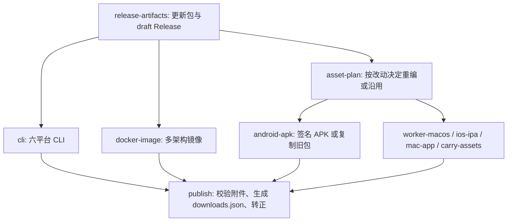

# Android 版本与 GitHub 发版作业

## 版本边界

Android 手机/平板使用独立发行版本，唯一来源是 `apps/android/version.properties`。
首个官方版本为 `0.1.0`，安装版本码为 `30000001`，高于旧开发包的 `YYYYMMDD` 编码。
每次发布有变化的 Android 客户端，递增 `versionName` 和 `versionCode`，例如
`0.1.1 / 30000002`。同一天可以发布多个版本；同一提交重复构建不会自动改版本。
`versionCode` 必须递增且不超过 Android 的 `2100000000` 上限。

服务器继续使用 `vX.Y.Z`，Apple App 继续使用 `apps/apple/project.yml` 中的
`MARKETING_VERSION`。服务器发版只是 Android APK 的分发入口，不能拿服务器 tag
冒充 Android 客户端版本。以后新增 Android TV / Wear 等独立客户端时，给它们独立的
applicationId、版本文件和附件名；当前不预建尚未实现的产品或构建变体。

## 现有工作流分工

| 工作流 | 入口 | 职责 |
|---|---|---|
| `ci` | PR | Python、Web、CLI、Worker 的改动检查 |
| `ios` | PR | iPhone / TV / Mac 编译与测试，按路径运行 |
| `Android stability` | Android 或发版工作流改动的 PR / main push | 原生生命周期、场景测试、lint、APK，以及临时测试证书的完整 release 打包 |
| `downloads` | 下载元数据、打包脚本或发版工作流的 PR | 清单、签名检查和旧包沿用回归测试 |
| `release` | `v*` tag 或手动输入 tag | 创建 draft、构建/复制附件、发布 Docker、终审后转正 |
| `release-kick` | `release-kick/v*` 分支 | 校验服务器版本并触发 `release`，之后删除点火分支 |
| `docker-image` | `release` 调用或手动 | 多架构镜像及 tag 发布 |
| `release-notes` | changelog 合入 main | 同步对应 Release 的正文 |

`claude*` 和 `runtime-guard` 分别用于协作自动化、运行时兼容检查，不负责打包发布。

`release` 的作业链：



Android APK 是必需附件，构建或沿用失败会阻止 draft 转正。原有 Mac / IPA / Worker
仍是可选附件，失败会显示红色作业，可重跑补传。Android 无改动时复制旧 APK 和其 JSON，
版本、签名、SHA-256 均保持旧包真实值；`force_rebuild` 可要求所有客户端附件重编。

## Android 产物与下载地址

当前支持 Android 8.0（API 26）及以上、arm64-v8a 手机/平板。

- `MovieClaw-Android-arm64.apk`：可直接安装的正式签名包，包含 Exo、MPV 及原生依赖。
- `MovieClaw-Android-arm64.json`：由 `aapt2` / `apksigner` 读取 APK 后生成的版本、
  安装版本码、最低 SDK、大小、SHA-256 和签名证书指纹，沿用时与 APK 一起复制。
- `downloads.json`：汇总实际 Mac 与 Android 包信息，便于下载页读取各客户端独立版本。

最新版固定入口（首个包含 Android 的正式 Release 发布后生效）：

<https://github.com/movieclaw/MovieClaw/releases/latest/download/MovieClaw-Android-arm64.apk>

指定服务器发行批次（将 `vX.Y.Z` 换成实际 tag）：

`https://github.com/movieclaw/MovieClaw/releases/download/vX.Y.Z/MovieClaw-Android-arm64.apk`

## 签名与本地打包

Android 自签名证书由 JDK `keytool` 免费生成，无需 Apple 开发者账号。
正式版本长期使用同一密钥；GitHub Secrets 保存 CI 所需信息，私钥和密码不进入 git。
仓库所需 Secrets：`ANDROID_KEYSTORE_BASE64`、`ANDROID_KEYSTORE_PASSWORD`、
`ANDROID_KEY_ALIAS`、`ANDROID_KEY_PASSWORD`。保存离线备份，重配 Secrets 时沿用同一密钥。

本地设置 `ANDROID_HOME`、`JAVA_HOME` 和以下四个环境变量后运行：

```bash
# 密码从本机凭证配置加载，不写进脚本或 shell 历史。
# ANDROID_KEYSTORE_PATH / ANDROID_KEYSTORE_PASSWORD / ANDROID_KEY_ALIAS / ANDROID_KEY_PASSWORD
bash apps/android/scripts/package-release.sh
```

产物位于 `apps/android/build/release/`。脚本禁用 Gradle 配置缓存，校验正式签名、
版本、架构及 MPV 依赖。原生库下载或校验失败会中止正式打包；开发 debug 构建仍允许 Exo-only。
PR 检查只生成短期测试证书，不接触正式签名密钥。

之前装过其他签名的开发包时，Android 不允许直接覆盖；迁移到官方签名包需要先卸载旧包。
之后官方签名保持一致，递增版本码即可覆盖升级并保留应用数据。

## 发版操作

1. Android 有功能/修复变动时，更新 `version.properties`；仅服务器变动时保持 Android 版本。
2. 按现有 release 规范更新服务器版本与 changelog，合入 main，触发 `release`。
3. 查看 `asset-plan` 和 `android-apk` 的构建/沿用结果；`publish` 检查 APK、JSON 和其他必需附件。
4. 在 Release 页面下载 APK；`android-apk` 作业摘要也提供本次固定 tag 下载链接。

验证命令：`python3 -m unittest discover -s scripts/tests`。完整打包验证运行上面的脚本，
检查 `aapt2` 包内版本、`apksigner` 签名和 APK → 元数据 → `downloads.json` 链路。
